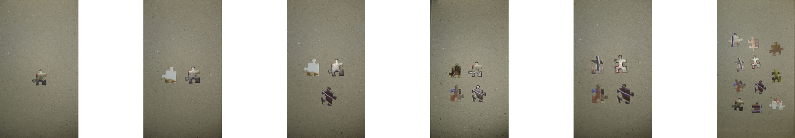
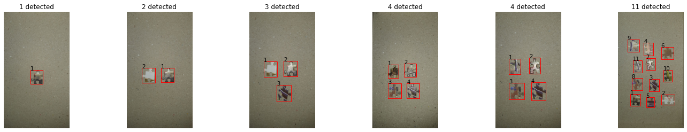

# Puzzle piece detection, counting and clustering: an edge-detection approach to image segmentation
 
Student: Luan Vinícius de Carvalho Martins

In this project, we aim to identify, count, and cluster puzzle pieces with similar shapes. This task can be useful as a common technique to solving large piece puzzles is to [group pieces with similar features together](https://ceaco.com/blogs/news/tips-tricks-completing-1000-piece-puzzle).    

Project goals:
 - Detect and count puzzle pieces from images;
 - Extract the shape of the piece;
 - Cluster pieces with the similar shape together.

Related activities: This project employs edge-detection, morphology techniques, and image measurements and characterization for shape matching. 

## Partial report

The partial report is available [here](/partial-report/preliminary-results.ipynb). 
The notebook describes the methodology and techniques. The code and preliminary results are also presented.
#### [Click here to access the partial report notebook, which contains a full description of the problem, approach, code and preliminary results](/partial-report/preliminary-results.ipynb)

## Input and output image examples
Expected input to the proposed technique is as follows. This set of images used in the [partial report notebook](/partial-report/preliminary-results.ipynb).
 

Expected output from the current technique is as follows. This image was extracted from [partial report notebook](/partial-report/preliminary-results.ipynb).
  

The images were taken by the student.

## References
 - Canny, J., 1986. A computational approach to edge detection. IEEE Transactions on pattern analysis and machine intelligence, (6), pp.679-698.
 - Hu, M.K., 1962. Visual pattern recognition by moment invariants. IRE transactions on information theory, 8(2), pp.179-187.
 