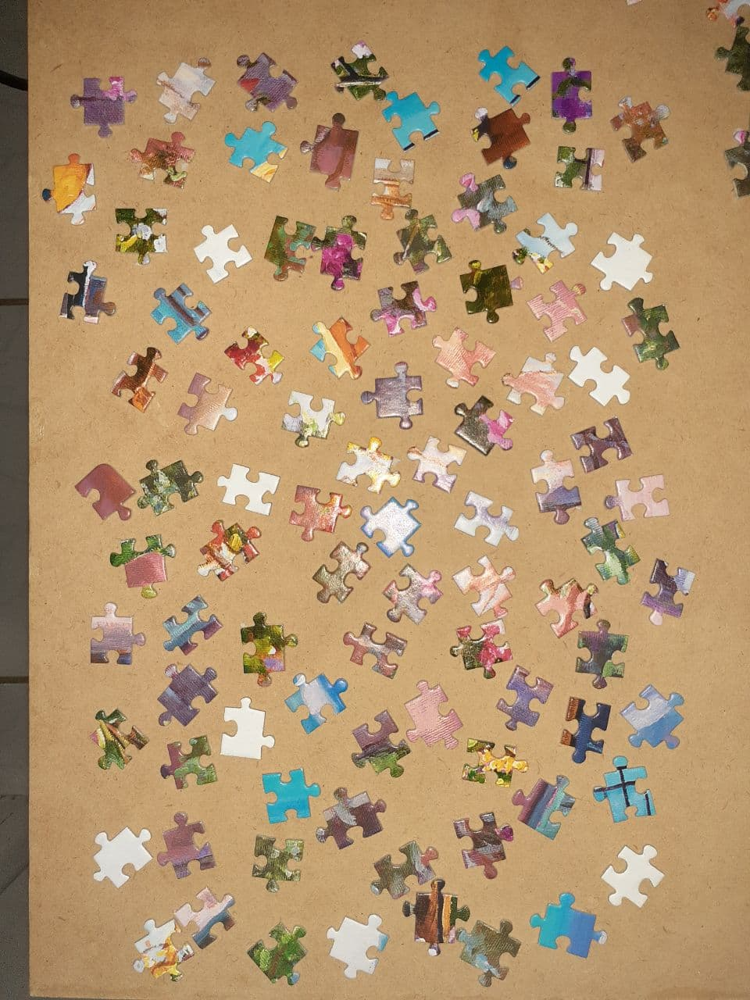
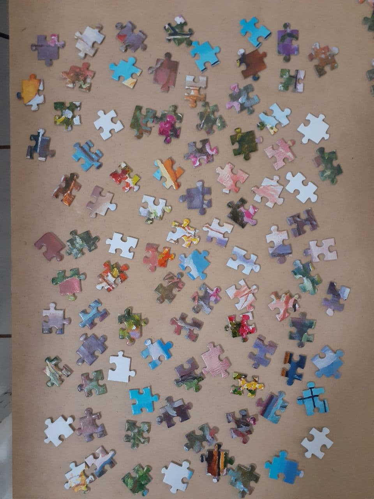

# proc-img-final-project

Características do projeto:
 - Título: Segmentação e agrupamento de peças de quebra-cabeça
 - Aluno: Luan Vinícius de Carvalho Martins
 - Atividades relacionadas: segmentação de imagens, detecção de arestas, classificação de formas
 - Descrição: segmentar, contar e possivelmente agrupar as diferentes formas de peças de quebra-cabeça a partir de imagens tiradas de telefones celulares. As imagens serão obtidas do aluno e o método não exigiria nenhum treinamento. Como saída, a mesma imagem seria retornada, mas com as peças do quebra-cabeça destacadas na imagem. Se o estágio de agrupamento de formas for bem-sucedido, peças de formato semelhante seriam identificadas por cores iguais: ao resolver quebra-cabeças, uma técnica comum é agrupar peças de forma semelhante, esta aplicação tornaria este processo mais fácil ao resolver quebra-cabeças maiores. Além disso, o número de peças detectadas também seria impresso. 

## Exemplos de imagens de entrada

